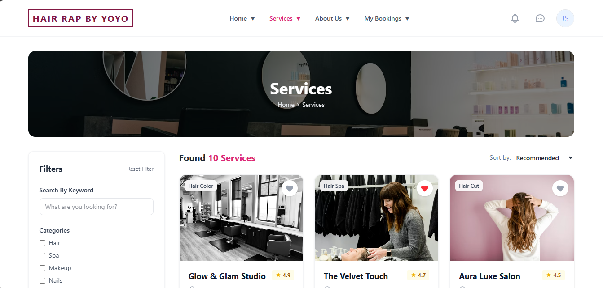
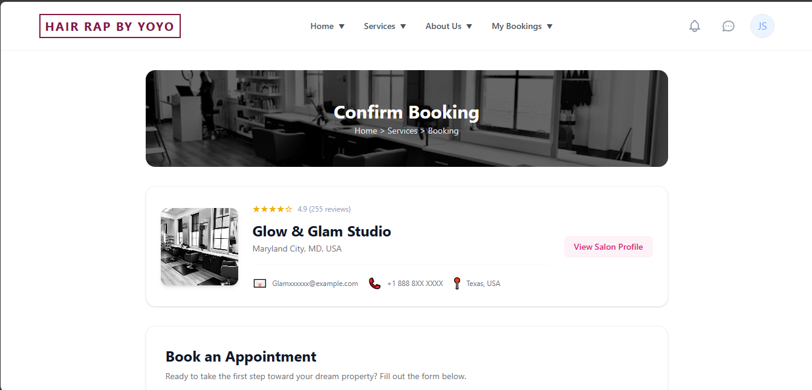
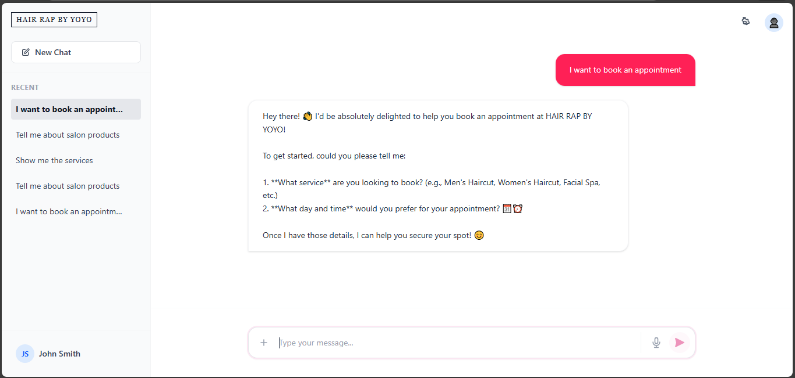
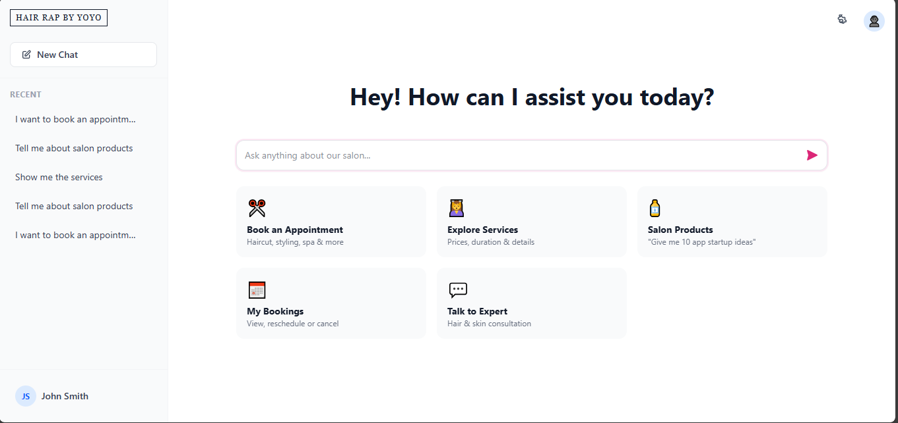

# Salon Booking Application

A premium, user-friendly frontend for a salon booking system built with **React**, **Redux Toolkit**, and **Tailwind CSS**.

## ✨ Features

- **🏠 Dedicated Home Page**: Hero section, service highlights, and featured salons.
- **💅 Service Listing**: Browse premium salon services with specific categories, location filters, and favorites.
- **📅 Smart Booking System**: 
    - Smooth booking flow with pre-filled details.
    - **Live Form Validation** (Formik & Yup).
    - Visual visual confirmation modal instead of browser alerts.
- **👤 Customer Dashboard**: 
    - **Sidebar Navigation**: Easy access to Bookings, Favorites, Wallet, etc.
    - **My Bookings**: View upcoming/past appointments with pagination and sorting.
    - **Cancellation**: Secure cancellation with confirmation prompts.
- **📱 Responsive Design**: Fully optimized for seamless mobile and desktop experience.

## 🛠️ Tech Stack & Approach

### Core Technologies
- **React (Vite)**: Fast, modern component-based UI.
- **Tailwind CSS**: Utility-first styling with a custom **premium design system** (glassmorphism, branded colors).
- **Redux Toolkit**: Centralized state management for Services, Bookings, and User preferences.
- **Formik & Yup**: Robust form validation and error handling.
- **Axios Mock Adapter**: Simulates realistic API latency and responses.

### Architecture
- **Router**: `react-router-dom` v6 for seamless client-side navigation.
- **State**: Redux slices (`servicesSlice`, `bookingsSlice`) with `createAsyncThunk`.
- **Components**: Modular design (`ServiceCard`, `CustomerSidebar`, `ConfirmModal`) for maintainability.

## 🚀 Setup Instructions

1.  **Install Dependencies**
    ```bash
    npm install
    ```

2.  **Run Development Server**
    ```bash
    npm run dev
    ```
    Open [http://localhost:5173](http://localhost:5173) to view the app.

3.  **Build for Production**
    ```bash
    npm run build
    ```

## 📸 Screenshots

### Home Page


### Service Listing


### Customer Dashboard


### Booking Flow


### AI Assistant


